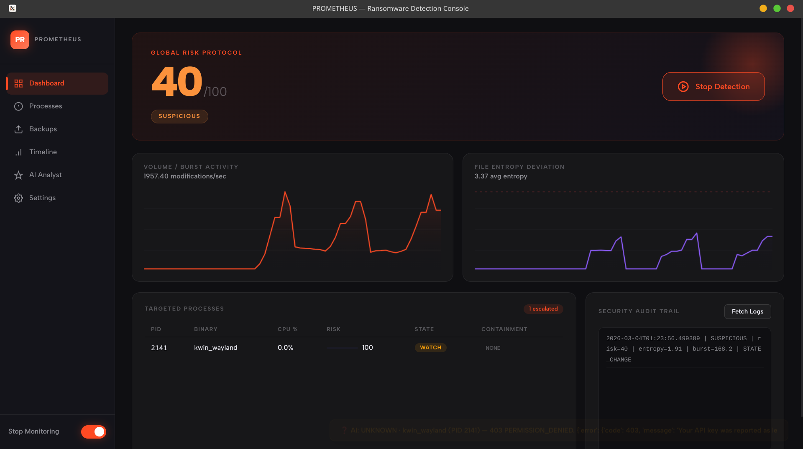
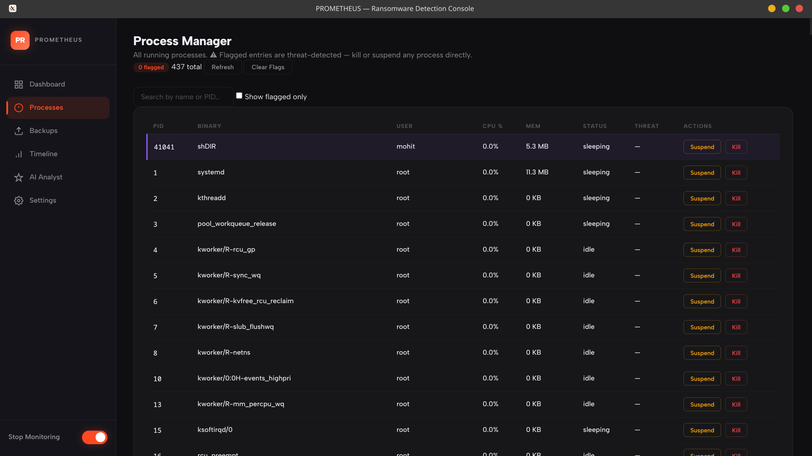
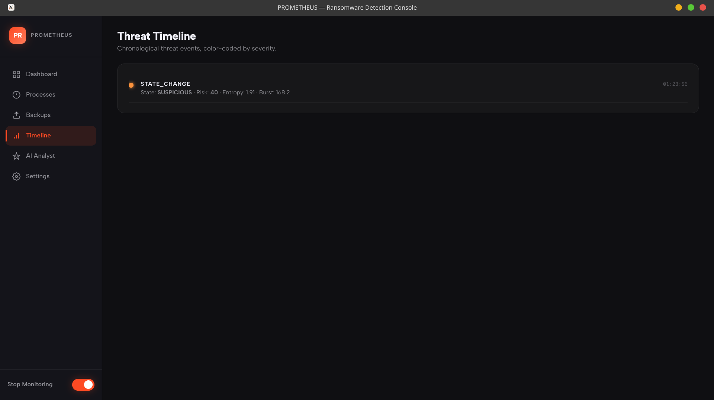
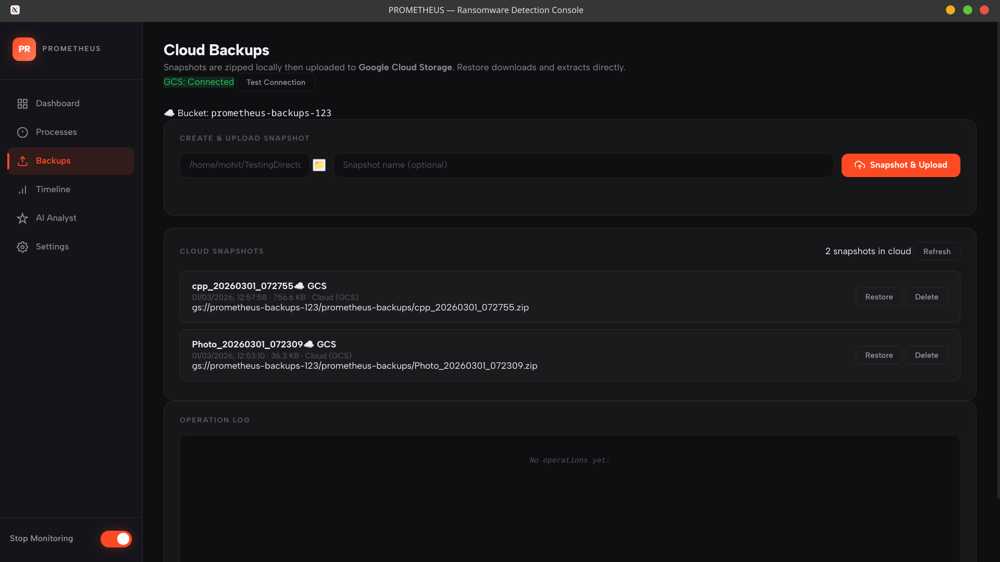
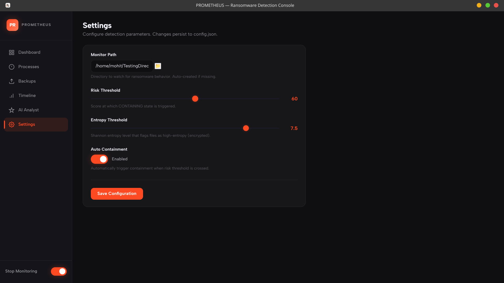

<div align="center">

# 🔴 PROMETHEUS
### AI-Powered Real-Time Ransomware Detection & Response System

<br/>


<br/>

> **PROMETHEUS** is a behavioral monitoring and AI threat-analysis system for Linux. It watches your filesystem in real time, scores suspicious activity, and uses Google's **Gemini 2.5 Flash** to render a verdict — all from a sleek Electron desktop interface.

</div>

---

## 📸 Screenshots

<table>
  <tr>
    <td align="center"><b>🖥️ Dashboard</b></td>
    <td align="center"><b>⚙️ Processes</b></td>
  </tr>
  <tr>
    <td></td>
    <td></td>
  </tr>
  <tr>
    <td align="center"><b>📋 Timeline</b></td>
    <td align="center"><b>☁️ Backups</b></td>
  </tr>
  <tr>
    <td></td>
    <td></td>
  </tr>
  <tr>
    <td align="center" colspan="2"><b>🔧 Settings</b></td>
  </tr>
  <tr>
    <td colspan="2" align="center"></td>
  </tr>
</table>

---

## ✨ Features

### 🛡️ Real-Time Behavioral Detection
- Monitors a target directory using `watchdog` for file modification, creation, and deletion bursts
- Calculates **Shannon entropy** per file to detect encryption-in-progress (values >7.0 are flagged)
- Tracks **extension changes**, **burst rates**, and **unique directories** accessed

### 🧠 Gemini AI Analyst
- Sends live system telemetry (risk score, entropy, process list) to **Gemini 2.5 Flash**
- Returns a structured verdict: `RANSOMWARE | SUSPICIOUS | BENIGN | UNKNOWN`
- Supports **per-process AI analysis** — deep-dive into any running process by PID
- Generates a full **Markdown Incident Report** on demand, including timeline, indicators, and recommended actions
- Built-in **exponential-backoff retry** for API rate limits

### ⚡ Automated Containment
- Configurable **auto-containment** mode that can terminate suspicious processes automatically
- **Privileged process killing** with appropriate system permissions
- Alerts are triggered the moment the risk score crosses the configured threshold

### ☁️ Cloud Backup (Google Cloud Storage)
- Creates **encrypted ZIP snapshots** of the monitored directory
- Uploads to your GCS bucket automatically on threat detection
- Tracks backup status and metadata for each snapshot

### 🖥️ Electron Desktop UI
Five fully-featured tabs:
| Tab | Description |
|-----|-------------|
| **Dashboard** | Live risk score gauge, entropy graph, threat state, and AI verdict feed |
| **Processes** | Full live process table with per-process AI analysis button |
| **Timeline** | Chronological event log of all filesystem & threat events |
| **Backups** | Manage and trigger cloud backups, view backup history |
| **Settings** | Configure monitored path, thresholds, GCS bucket, and Gemini API key |

---

## 🏗️ Architecture

```
┌─────────────────────────────────────────────────────────┐
│                   Electron Frontend (UI)                 │
│     Dashboard · Processes · Timeline · Backups · Settings│
└───────────────────────┬─────────────────────────────────┘
                        │ HTTP (localhost)
┌───────────────────────▼─────────────────────────────────┐
│               Flask REST API  (api/server.py)            │
│  /scan · /processes · /timeline · /ai/* · /backup/*      │
└──────┬──────────────────────────┬────────────────────────┘
       │                          │
┌──────▼──────┐          ┌────────▼──────────┐
│ Core Engine │          │  Gemini AI Analyst │
│  (core/)    │          │  (api/ai_analyst)  │
│             │          │  gemini-2.5-flash  │
│ • analyzer  │          └────────────────────┘
│ • collector │
│ • entropy   │          ┌────────────────────┐
│ • scorer    │          │  Google Cloud      │
│ • exporter  │          │  Storage Backups   │
└──────┬──────┘          └────────────────────┘
       │
┌──────▼──────────────────┐
│ File System (watchdog)  │
│ + Process Monitor       │
│   (psutil)              │
└─────────────────────────┘
```

---

## 📁 Project Structure

```
Neon-Genesis-Core-Engine/
│
├── core/                     # Detection engine modules
│   ├── analyzer.py           # Behavioral feature extraction
│   ├── collector.py          # Process & filesystem data collector
│   ├── entropy.py            # Shannon entropy calculator
│   ├── scorer.py             # Risk score engine
│   └── exporter.py           # Log & JSON exporter
│
├── api/                      # Flask REST API
│   ├── server.py             # All HTTP endpoints
│   └── ai_analyst.py         # Gemini AI integration module
│
├── electron/                 # Desktop application
│   ├── main.js               # Electron main process
│   ├── preload.js            # Secure context bridge
│   └── renderer/             # Frontend (HTML/CSS/JS)
│
├── cloud_storage.py          # GCS backup manager
├── main.py                   # Entry point
├── config.example.json       # ← Copy this to config.json and fill in your keys
├── requirements.txt          # Python dependencies
└── .gitignore
```

---

## 🚀 Getting Started

### Prerequisites

- Python **3.10+**
- Node.js **18+**
- A [Google Gemini API key](https://aistudio.google.com/app/apikey)
- *(Optional)* A Google Cloud project with a GCS bucket and a service account key, for cloud backups

### 1. Clone the Repository

```bash
git clone https://github.com/ankushkhakale/Neon-Genesis.git
cd Neon-Genesis
```

### 2. Set Up the Python Backend

```bash
# Create and activate a virtual environment
python3 -m venv venv
source venv/bin/activate

# Install dependencies
pip install -r requirements.txt
```

### 3. Configure

```bash
# Copy the example config and fill in your values
cp config.example.json config.json
```

Edit `config.json`:
```json
{
  "monitor_path": "/path/to/directory/to/watch",
  "risk_threshold": 60,
  "entropy_threshold": 7.5,
  "auto_containment": false,
  "gcs_enabled": false,
  "gcs_bucket_name": "your-gcs-bucket-name",
  "gcs_credentials": "gcs_key.json",
  "gemini_api_key": "YOUR_GEMINI_API_KEY_HERE",
  "gemini_model": "gemini-2.5-flash"
}
```

> ⚠️ **Never commit your real `config.json` or `gcs_key.json` to GitHub.** They are already in `.gitignore`.

### 4. Start the Backend

```bash
python main.py
```

### 5. Launch the Electron Frontend

```bash
cd electron
npm install
npm start
```

The app will open automatically.

---

## 🛠️ Tech Stack

| Layer | Technology |
|-------|-----------|
| **Frontend** | Electron, HTML5, CSS3, Vanilla JS |
| **Backend API** | Python, Flask |
| **File Monitoring** | `watchdog` |
| **Process Monitoring** | `psutil` |
| **AI Analysis** | Google Gemini 2.5 Flash (`google-generativeai`) |
| **Cloud Backup** | Google Cloud Storage (`google-cloud-storage`) |
| **Data Validation** | `pydantic` |

---

## 🔬 How the Risk Score Works

The scorer aggregates multiple behavioral signals into a single 0–100 risk score:

| Signal | Weight | Description |
|--------|--------|-------------|
| File modification burst | High | Sudden spike in writes/sec |
| Shannon entropy | High | Average >7.0 suggests active encryption |
| Extension changes | Medium | Mass renaming to new extensions |
| Deletion burst | Medium | Rapid file deletions |
| Unique dirs accessed | Low | Spreading across directories |

Once the score exceeds `risk_threshold` (default: **60**), the system enters `SUSPICIOUS` state and triggers the AI Analyst automatically.

---

## ⚠️ Disclaimer

This project is developed strictly for **defensive cybersecurity research and educational purposes**. It is designed to detect and mitigate ransomware threats — not to simulate or distribute malicious software.

---

## 👥 Team

**Neon Genesis**

---

<div align="center">
  <sub>Built with ❤️ for a safer system</sub>
</div>